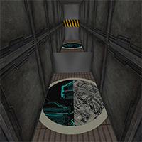

## **Causality Paradox**
In this first person puzzle (FPP) game, you must escape and progress through a series of locked rooms surrounded by the serentity of space in a low-security space prison.

[][fpp]

To escape you must reverse time and collobarate with your past self to push buttons, make daring leaps, and occasionally sacrifice your past self.

Welcome to the implausible physics of **[Causality Paradox][fpp]**.

[fpp]: http://jzwood.github.io/FPP/build/home

**Caveats**
Safari doesn't support pointer lock and the physics are a little screwy on Fire Fox. It is recommended that this game be played on Chrome or Opera.
